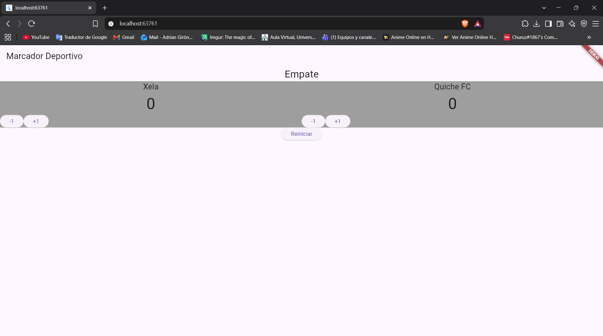
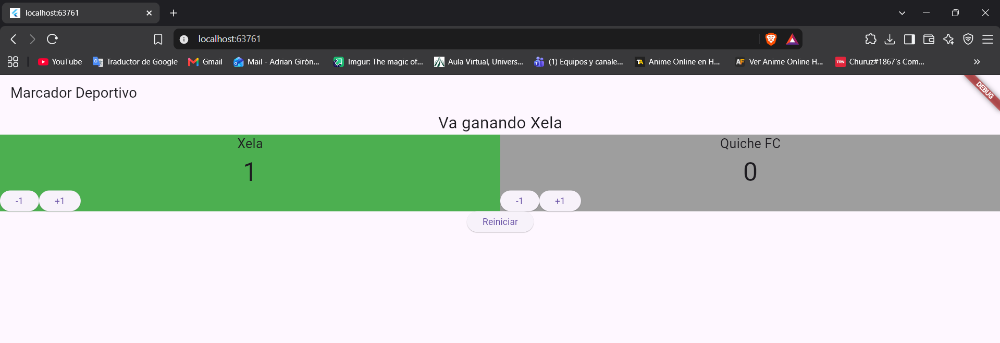

# Laboratorio Marcador Deportivo

## Capturas de pantalla

### Estado de Empate

### Equipo Ganando

---

## Pregunta Técnica

**¿Qué hace `setState` cuando presiona un botón y qué ocurriría si cambia los puntos sin llamarlo?**

`setState` le avisa a Flutter que una variable del estado cambió y obliga a la pantalla a redibujarse (`build`) para mostrar el nuevo valor. Si cambiamos los puntos sin usar `setState`, la variable en memoria sí suma o resta correctamente, pero la pantalla se quedaría congelada mostrando el número anterior porque nunca se le notificó que debía actualizarse.